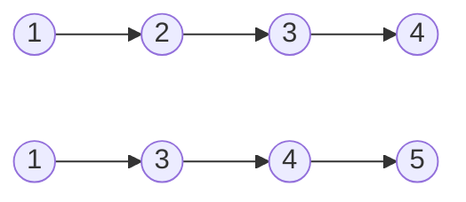

### Theory of linked lists

First of all we should start from the fact that linked list is a really generous invention in information technology sphere. Its used as maintain data struct in LISP language. Thus every each object is represented as linked list. 
Briefly, each node store special predefined data with a next element. Its needed for keeping chain of related data. Its may using in application with history options as a maintaining feature or apps where sequence of computed operations is a main.  For example GPS system might being implemented with a linked list to store each coordinate point for a route.
Despite cool features coming with linked list it has a bunch of complexities. First complexity is fetching out any element from a given sequence. It happening because we need compute previous nodes. If we want get the central element of sequence, we will increase time and computation resources.
There is a simple linked list which show us direction of relationships between each element of sequence. In case getting `3`  from sequence we should get both previous elements `1` and `2`.


### Merging linked lists

So lets imagine that you got a task which is saying to merge two linked lists. As shown below.

Input:


Output:

This task will be solved with C# programming language, however concept might being used with other programming language.

Solution could be in passing both linked lists and appending fewer element to the third linked list.

```c# 

/**
 * This problem were solved and taken from leetcode.com
 * Definition for singly-linked list.
 * public class ListNode {
 *     public int val;
 *     public ListNode next;
 *     public ListNode(int val=0, ListNode next=null) {
 *         this.val = val;
 *         this.next = next;
 *     }
 * }
 */

public class Solution {
    public ListNode MergeTwoLists(ListNode list1, ListNode list2) {
        ListNode genezis = new ListNode();
        ListNode current = genezis;
        
        while(list1 != null && list2 != null)
        {
            if(list1.val <= list2.val){
                current.next = list1;
                list1 = list1.next;
            }
            else {
                current.next = list2;
                list2 = list2.next;
            }
            current = current.next;
        }

        if(list1 != null) {
            current.next = list1;
        }
        else if(list2 != null){
            current.next = list2;
        }
        
        return genezis.next;
    }
}
```

As you can see it does not save from item duplicates. Emphasis is on the data integrity and guaranty of journaling. Also side problem coming from memory, because we are creating third linked list with the genesis object (start node).

